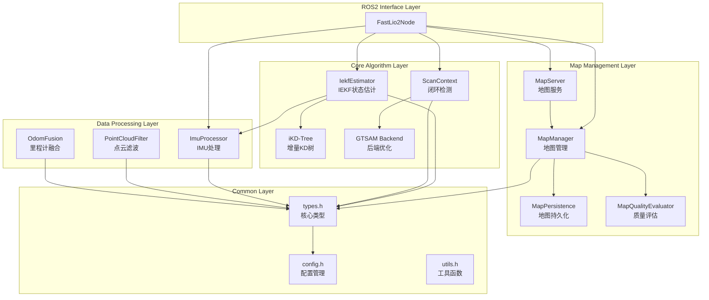

# rosiwit_slam 模块关系图

**版本**: 1.2.0
**更新日期**: 2026-05-05

---

## 目录

1. [系统架构概览](#系统架构概览)
2. [模块依赖关系](#模块依赖关系)
3. [数据流向图](#数据流向图)
4. [类继承关系](#类继承关系)
5. [模块详细说明](#模块详细说明)

---

## 系统架构概览

```
┌─────────────────────────────────────────────────────────────────────────────┐
│                          ROS2 SLAM Node (rosiwit_slam)                      │
├─────────────────────────────────────────────────────────────────────────────┤
│                                                                             │
│  ┌─────────────┐    ┌─────────────┐    ┌─────────────┐                    │
│  │   LiDAR     │    │    IMU      │    │   Odometry  │                    │
│  │  Driver     │    │   Driver    │    │   Driver    │                    │
│  └──────┬──────┘    └──────┬──────┘    └──────┬──────┘                    │
│         │                  │                  │                            │
│         ▼                  ▼                  ▼                            │
│  ┌─────────────────────────────────────────────────────────────────┐      │
│  │                    Data Preprocessing Module                     │      │
│  │  ┌──────────────┐  ┌──────────────┐  ┌──────────────┐          │      │
│  │  │ PointCloud   │  │ IMU Buffer   │  │ Odom Buffer  │          │      │
│  │  │ Filter       │  │ & Undistort  │  │ & Sync       │          │      │
│  │  └──────────────┘  └──────────────┘  └──────────────┘          │      │
│  └─────────────────────────────────────────────────────────────────┘      │
│                                  │                                         │
│                                  ▼                                         │
│  ┌─────────────────────────────────────────────────────────────────┐      │
│  │                   State Estimation Module                        │      │
│  │  ┌───────────────────────────────────────────────────────────┐  │      │
│  │  │              FAST-LIO2 Core (IEKF)                         │  │      │
│  │  │  ┌────────────┐  ┌────────────┐  ┌────────────┐          │  │      │
│  │  │  │ Prediction │  │  Feature   │  │  Update    │          │  │      │
│  │  │  │ (IMU)      │  │ Extraction │  │ (LiDAR)    │          │  │      │
│  │  │  └────────────┘  └────────────┘  └────────────┘          │  │      │
│  │  │                          │                                 │  │      │
│  │  │                          ▼                                 │  │      │
│  │  │                   ┌────────────┐                          │  │      │
│  │  │                   │ iKD-Tree   │                          │  │      │
│  │  │                   │ Map        │                          │  │      │
│  │  │                   └────────────┘                          │  │      │
│  │  └───────────────────────────────────────────────────────────┘  │      │
│  └─────────────────────────────────────────────────────────────────┘      │
│                                  │                                         │
│        ┌───────────────┬─────────┴─────────┬───────────────┐             │
│        ▼               ▼                   ▼               ▼             │
│  ┌──────────┐  ┌──────────────┐  ┌──────────────────┐  ┌──────────┐    │
│  │OdomFusion│  │ Loop Closure │  │   Map Manager    │  │ Map Server│    │
│  │          │  │              │  │                  │  │          │    │
│  │ - Odom   │  │ - ScanContext│  │ - Submap System  │  │ - ROS2   │    │
│  │ - Fusion │  │ - GTSAM      │  │ - Persistence    │  │ - Services│    │
│  │          │  │              │  │ - Quality Eval   │  │          │    │
│  └──────────┘  └──────────────┘  └──────────────────┘  └──────────┘    │
│        │               │                   │               │             │
│        └───────────────┴─────────┬─────────┴───────────────┘             │
│                                  ▼                                        │
│  ┌─────────────────────────────────────────────────────┐                 │
│  │                 Output Interface                     │                 │
│  │  ┌─────┐  ┌─────┐  ┌─────┐  ┌─────┐  ┌─────┐      │                 │
│  │  │Odom │  │Path │  │Map  │  │ TF  │  │Info │      │                 │
│  │  └─────┘  └─────┘  └─────┘  └─────┘  └─────┘      │                 │
│  └─────────────────────────────────────────────────────┘                 │
└─────────────────────────────────────────────────────────────────────────────┘
```

---

## 模块依赖关系

### 模块层次结构

```
                    ┌───────────────────┐
                    │   FastLio2Node    │  (Level 0: 顶层ROS2节点)
                    │   (ros_interface) │
                    └─────────┬─────────┘
                              │
        ┌─────────────────────┼─────────────────────┐
        │                     │                     │
        ▼                     ▼                     ▼
┌───────────────┐    ┌───────────────┐    ┌───────────────┐
│ IekfEstimator │    │  MapManager   │    │  MapServer    │  (Level 1: 核心模块)
│(fast_lio2_core)│    │ (map_manager) │    │ (map_manager) │
└───────┬───────┘    └───────┬───────┘    └───────┬───────┘
        │                    │                    │
        │            ┌───────┴───────┐            │
        │            │               │            │
        ▼            ▼               ▼            ▼
┌───────────────┐ ┌───────────────┐ ┌───────────────┐ ┌───────────────┐
│  ImuProcessor │ │ MapPersistence│ │ MapQuality    │ │ MapManager    │  (Level 2: 子模块)
│(data_preproc) │ │(map_manager) │ │ (map_manager) │ │   Config      │
└───────┬───────┘ └───────────────┘ └───────────────┘ └───────────────┘
        │
        ▼
┌───────────────┐ ┌───────────────┐ ┌───────────────┐ ┌───────────────┐
│PointCloudFilter│ │   ImuBuffer   │ │  ScanContext  │ │  IKdTree      │  (Level 3: 基础组件)
│(data_preproc) │ │   (common)    │ │(loop_closure) │ │(fast_lio2_core)│
└───────┬───────┘ └───────────────┘ └───────────────┘ └───────────────┘
        │
        ▼
┌───────────────────────────────────────────────────────────────────────┐
│                          Level 4: 公共类型和配置                       │
│  ┌───────────────┐  ┌───────────────┐  ┌───────────────┐              │
│  │    types.h    │  │   config.h    │  │   utils.h     │              │
│  │   (common)    │  │   (common)    │  │   (common)    │              │
│  └───────────────┘  └───────────────┘  └───────────────┘              │
└───────────────────────────────────────────────────────────────────────┘
```

### 模块依赖图（Mermaid格式）



---

## 数据流向图

### 点云处理数据流

```
┌─────────────────────────────────────────────────────────────────────────┐
│                          点云处理数据流                                  │
└─────────────────────────────────────────────────────────────────────────┘

     LiDAR传感器
         │
         ▼
  [ROS2 Topic: /lidar_points]
         │
         ▼
  ┌───────────────────┐
  │ lidarCallback()   │
  │ - 转换格式        │
  │ - 时间戳提取      │
  └─────────┬─────────┘
            │
            ▼
  ┌───────────────────┐     ┌───────────────────┐
  │ PointCloudFilter  │◄────│   ImuProcessor    │
  │ - Voxel滤波       │     │ - 去畸变          │
  │ - 特征提取        │     │ - IMU预测         │
  └─────────┬─────────┘     └───────────────────┘
            │
            ▼
  ┌───────────────────┐
  │ IekfEstimator     │
  │ - IMU预测         │◄─────────────┐
  │ - 特征匹配        │              │
  │ - IEKF更新        │              │
  └─────────┬─────────┘              │
            │                        │
            ▼                        │
  ┌───────────────────┐              │
  │    iKD-Tree       │◄─────────────┘ (地图查询)
  │ - 最近邻搜索      │
  │ - 增量插入        │
  └─────────┬─────────┘
            │
            ▼
  ┌───────────────────┐
  │   MapManager      │
  │ - 子地图更新      │
  │ - 地图合并        │
  └─────────┬─────────┘
            │
            ▼
  [ROS2 Topic: /cloud_map]
```

### IMU处理数据流

```
┌─────────────────────────────────────────────────────────────────────────┐
│                          IMU处理数据流                                   │
└─────────────────────────────────────────────────────────────────────────┘

     IMU传感器
         │
         ▼
  [ROS2 Topic: /imu/data]
         │
         ▼
  ┌───────────────────┐
  │ imuCallback()     │
  │ - 转换格式        │
  │ - 添加到缓冲区    │
  └─────────┬─────────┘
            │
            ▼
  ┌───────────────────┐
  │   ImuBuffer       │
  │ - 线程安全存储    │
  │ - 时间区间查询    │
  └─────────┬─────────┘
            │
            ▼
  ┌───────────────────┐
  │  ImuProcessor     │
  │ - 偏置估计        │
  │ - 状态预测        │
  │ - 去畸变          │
  └─────────┬─────────┘
            │
            ├──────────────────────┐
            │                      │
            ▼                      ▼
  ┌───────────────────┐    ┌───────────────────┐
  │ IekfEstimator     │    │  PointCloudFilter │
  │ - IMU预测步       │    │ - 点云去畸变      │
  └───────────────────┘    └───────────────────┘
```

### 闭环检测数据流

```
┌─────────────────────────────────────────────────────────────────────────┐
│                          闭环检测数据流                                  │
└─────────────────────────────────────────────────────────────────────────┘

     关键帧触发
         │
         ▼
  ┌───────────────────┐
  │   ScanContext     │
  │ - 描述子生成      │
  │ - 闭环检测        │
  └─────────┬─────────┘
            │
            ▼
  ┌───────────────────┐
  │ LoopConstraint    │
  │ - 闭环约束        │
  │ - 相对位姿        │
  └─────────┬─────────┘
            │
            ▼
  ┌───────────────────┐
  │   GtsamBackend    │
  │ - 位姿图构建      │
  │ - 因子添加        │
  │ - 优化求解        │
  └─────────┬─────────┘
            │
            ▼
  ┌───────────────────┐
  │   MapManager      │
  │ - 地图校正        │
  │ - 位姿更新        │
  └─────────┬─────────┘
            │
            ▼
  [闭环优化完成]
```

---

## 类继承关系

### 主要类关系图

```
┌─────────────────────────────────────────────────────────────────────────┐
│                          类继承关系                                      │
└─────────────────────────────────────────────────────────────────────────┘

                          rclcpp::Node
                               │
                               ▼
                       ┌───────────────┐
                       │ FastLio2Node  │
                       └───────────────┘

┌─────────────────────────────────────────────────────────────────────────┐
│                          独立类（无继承关系）                            │
└─────────────────────────────────────────────────────────────────────────┘

  ┌─────────────────────────────────────────────────────────────────────┐
  │                        状态估计类                                    │
  │  ┌───────────────┐                                                 │
  │  │ IekfEstimator │  (核心算法类)                                   │
  │  └───────────────┘                                                 │
  │  ┌───────────────┐                                                 │
  │  │    IKdTree    │  (数据结构类)                                   │
  │  └───────────────┘                                                 │
  └─────────────────────────────────────────────────────────────────────┘

  ┌─────────────────────────────────────────────────────────────────────┐
  │                        地图管理类                                    │
  │  ┌───────────────┐  ┌───────────────┐  ┌───────────────┐           │
  │  │  MapManager   │  │  MapServer    │  │MapPersistence │           │
  │  └───────────────┘  └───────────────┘  └───────────────┘           │
  │  ┌───────────────┐                                                 │
  │  │MapQualityEval │                                                 │
  │  └───────────────┘                                                 │
  └─────────────────────────────────────────────────────────────────────┘

  ┌─────────────────────────────────────────────────────────────────────┐
  │                        数据处理类                                    │
  │  ┌───────────────┐  ┌───────────────┐  ┌───────────────┐           │
  │  │ ImuProcessor  │  │PointCloudFlt  │  │  OdomFusion   │           │
  │  └───────────────┘  └───────────────┘  └───────────────┘           │
  └─────────────────────────────────────────────────────────────────────┘

  ┌─────────────────────────────────────────────────────────────────────┐
  │                        闭环检测类                                    │
  │  ┌───────────────┐  ┌───────────────┐                              │
  │  │  ScanContext  │  │ GtsamBackend  │                              │
  │  └───────────────┘  └───────────────┘                              │
  └─────────────────────────────────────────────────────────────────────┘

  ┌─────────────────────────────────────────────────────────────────────┐
  │                        数据结构类                                    │
  │  ┌───────────────┐  ┌───────────────┐  ┌───────────────┐           │
  │  │    State      │  │   ImuData     │  │PointCloudData │           │
  │  │  (struct)     │  │  (struct)     │  │  (struct)     │           │
  │  └───────────────┘  └───────────────┘  └───────────────┘           │
  │  ┌───────────────┐  ┌───────────────┐  ┌───────────────┐           │
  │  │   ImuBuffer   │  │   Submap      │  │ PoseNode      │           │
  │  │   (class)     │  │  (struct)     │  │  (struct)     │           │
  │  └───────────────┘  └───────────────┘  └───────────────┘           │
  └─────────────────────────────────────────────────────────────────────┘
```

---

## 模块详细说明

### 1. ROS接口层 (ros_interface)

**模块**: `FastLio2Node`

**职责**:
- ROS2节点管理
- 数据订阅与发布
- TF广播
- 参数配置
- 服务接口

**依赖模块**:
- 所有核心模块（IekfEstimator, MapManager, ImuProcessor等）

**输出**:
- 里程计 (`/odom_estimated`)
- 轨迹 (`/path_estimated`)
- 地图 (`/cloud_map`)
- TF变换

---

### 2. 核心算法层 (fast_lio2_core)

#### IekfEstimator

**职责**:
- IEKF状态估计
- IMU预测步
- LiDAR更新步
- 协方差更新

**依赖**:
- `IKdTree` (地图查询)
- `ImuProcessor` (IMU处理)
- `types.h` (数据结构)

#### IKdTree

**职责**:
- 增量式KD树管理
- 最近邻搜索
- 点云插入

**特点**:
- 支持增量更新
- 高效空间查询

---

### 3. 地图管理层 (map_manager)

#### MapManager

**职责**:
- 点云地图存储
- 子地图划分
- 地图滤波
- 内存优化

**依赖**:
- `types.h` (数据结构)
- `MapPersistence` (持久化)
- `MapQualityEvaluator` (质量评估)

#### MapServer

**职责**:
- ROS2服务接口
- 地图保存/加载服务
- 地图发布

**依赖**:
- `MapManager` (地图管理)

#### MapPersistence

**职责**:
- 地图文件保存/加载
- 多格式支持 (PCD/PLY/BIN)
- 位姿图保存/加载 (G2O)

#### MapQualityEvaluator

**职责**:
- 地图质量评估
- 密度计算
- 空洞检测

---

### 4. 数据处理层 (data_preprocessor)

#### ImuProcessor

**职责**:
- IMU数据管理
- 状态预测
- 去畸变处理
- 偏置估计

**关键算法**:
- IMU预积分
- 状态传播

#### PointCloudFilter

**职责**:
- Voxel滤波
- 离群点去除
- 特征提取

---

### 5. 闭环检测层 (loop_closure)

#### ScanContext

**职责**:
- Scan Context描述子生成
- 闭环检测
- 闭环约束估计

#### GtsamBackend

**职责**:
- 位姿图构建
- 因子添加
- 优化求解

---

### 6. 公共层 (common)

#### types.h

**职责**:
- 核心数据结构定义
- State, ImuData, PointCloudData
- ImuBuffer, Submap, PoseNode

#### config.h

**职责**:
- 配置参数定义
- YAML文件加载

#### utils.h

**职责**:
- 工具函数
- 数学计算
- 坐标转换

---

## 模块接口关系表

| 模块 | 输入 | 输出 | 被依赖 |
|------|------|------|--------|
| FastLio2Node | ROS2 Topics | ROS2 Topics/TF | - |
| IekfEstimator | ImuData, PointCloudData | State | FastLio2Node |
| IKdTree | PointCloud | 最近邻点 | IekfEstimator |
| MapManager | PointCloud, Pose | MapPointCloud | FastLio2Node, MapServer |
| MapServer | Service Request | Service Response | FastLio2Node |
| ImuProcessor | ImuData | State Prediction | FastLio2Node, IekfEstimator |
| PointCloudFilter | RawPointCloud | FilteredPointCloud | FastLio2Node |
| ScanContext | KeyframeCloud | LoopConstraint | FastLio2Node |

---

## 配置文件依赖关系

```
                    config/default.yaml
                           │
                           ▼
                    ┌───────────────┐
                    │ ConfigParams  │
                    └───────────────┘
                           │
        ┌──────────────────┼──────────────────┐
        │                  │                  │
        ▼                  ▼                  ▼
  ┌───────────────┐ ┌───────────────┐ ┌───────────────┐
  │  ImuParams    │ │ LidarParams   │ │  IekfParams   │
  └───────────────┘ └───────────────┘ └───────────────┘
        │                  │                  │
        ▼                  ▼                  ▼
  ┌───────────────┐ ┌───────────────┐ ┌───────────────┐
  │ImuProcessor   │ │PointCloudFlt │ │ IekfEstimator │
  └───────────────┘ └───────────────┘ └───────────────┘
        │
        ▼
  ┌───────────────┐ ┌───────────────┐ ┌───────────────┐
  │LoopClosurePm  │ │ OdomFusionPm │ │   MapParams   │
  └───────────────┘ └───────────────┘ └───────────────┘
        │                  │                  │
        ▼                  ▼                  ▼
  ┌───────────────┐ ┌───────────────┐ ┌───────────────┐
  │  ScanContext  │ │  OdomFusion  │ │  MapManager   │
  └───────────────┘ └───────────────┘ └───────────────┘
```

---

## 参考资料

- [FAST-LIO2论文](https://arxiv.org/abs/2107.06829)
- [FAST-LIO2代码库](https://github.com/hku-mars/FAST_LIO)
- [Scan Context](https://github.com/irapkaist/SC-LeGO-LOAM)
- [GTSAM](https://gtsam.org/)
- [ROS2文档](https://docs.ros.org/en/humble/)